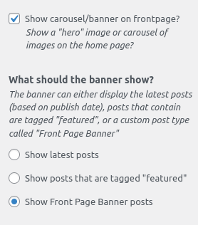

# DSA Wordpress Theme V2

> Theme for https://dsausa.org. Current version defined in styles.scss.

---

## Getting started

First, clone the repository:

```bash
$ git clone git@gitlab.com:dsausa/website/wordpress-theme-v2
```

### Dependencies

1. Node.js
2. Yarn

### Local development

1. Install [Local by Flywheel](https://localwp.com/).
2. Start up Local and create a new site. In this example, the site is named `dsausa`.
   - Note the WordPress admin user/pass you created, you'll need it later.
3. Clone this repository to your local machine.
    - You can use [GitHub desktop](https://desktop.github.com/) with your Gitlab account if you aren't comfortable with the command line. Go to file > clone > URL to clone a GitLab repo.
    - Don't forget to use a [Personal Access Token](https://gitlab.com/-/profile/personal_access_tokens) rather than your password if prompted.
4. Create a symlink to this repo in in the directory created by Flywheel `(your user directory)/Local Sites/dsausa/app/public/wp-content/themes/`.
    - Make sure to provide the full paths when creating symbolic links!
    - On Windows, you need to symlink to an empty folder, and don't forget to use Windows slashes \
    - Instructions for creating a symlink on Windows is [here](https://docs.microsoft.com/en-us/windows-server/administration/windows-commands/mklink) and macOS/Linux is [here](https://kb.iu.edu/d/abbe).
    - Example when running cmd.exe as admin: `mklink /d "C:\Users\username\Local Sites\dsausa\app\public\wp-content\themes\dsausa"  C:\Users\username\Documents\GitHub\wordpress-theme-v2\`
5. Clone the [DSA VeeOne Support Plugin](https://gitlab.com/dsausa/website/plugin-v1-support) to your local machine.
6. Create a symbolic link to the plugin repository in the directory `~/Local Sites/dsausa/app/public/wp-content/plugins/`.
   - Example: `mklink /d "C:\Users\user\Local Sites\dsausa\app\public\wp-content\plugins\dsaveeone" C:\Users\user\Documents\GitHub\plugin-v1-support`
7. Start dsausa in Local.
8. Navigate to [the themes settings page](http://dsausa.local/wp-admin/themes.php) and activate the DSA Vee Two theme.
9.  Navigate to [the plugins settings page](http://dsausa.local/wp-admin/plugins.php) and activate DSA Vee One Support.
10. You should now be able to see the DSA redesign site running at http://dsausa.local
11. Go to Appearance > Customize from the Wordpress admin dashboard and set the following:
    - DSA Main > Post Types: Enable all post types
    - DSA Main > Layout: Check the "Show carousel/banner on frontpage?" box, and when the "What should the banner show?" option appears, select "Show Front Page Banner posts" (see screenshot below)
12. Ask in Slack for a content export (an XML file), and go to Tools > Import
   and select the `WordPress Importer` to upload the XML file.
13. Uploading will take 5-10 minutes, and afterwards you'll be able to view the
   site with content.
14. Navigation and footer menus will need to be re-created from the
   Wordpress admin dashboard (Appearance > Menus).



## Modifying styles

To modify theme styling:

1. Install [yarn](https://yarnpkg.com) and run `yarn install` from the root
   project folder to get dependencies.
2. After dependencies are installed, run `yarn styles:watch` (or just `yarn styles` to
   omit file-watching).
3. Make modifications to `style.scss` and reload your browser to see changes.

## Theme tips

### Navigation menu items

The theme comes with a series of icon SVG files located in `/icons`.

To give a navigation menu item an icon, set its Title Attribute to
the icon name, such as "handshake" or "compass" (You may need to change
options in the menu section to see the Title Attribute of menu items).

To add a description, put text in the Description field.

To add a new line to the description text, add '%NL%' without the quotes.

To add a horizontal line, add a blank / invalid menu item, and set the
Description to "linebreak" (You can set the label to whatever you want).

## Deployment

To update the theme, you'll need administrator access to the
[Wordpress dashboard](https://dsausa.org/wp-admin).

1. Make changes to the theme and get them checked into the `master` branch.
   Create a `.zip` file containing the entire theme folder. Make sure the
   version number has been bumped in the `style.scss` and compiled to
   the `style.css` file via `yarn styles`.
2. Log into the Wordpress network dashboard and navigate to the
   [Add Themes](https://www.dsausa.org/wp-admin/network/theme-install.php) section.
4. Upload a `.zip` file containing this project folder, and confirm the replacement
   of the existing theme 
5. After the new theme is verified to be working correctly, the old one
   can be deactivated and deleted from the network.

## Contributing

To contribute, check out a branch based on `master` and submit a
[Merge Request](https://docs.gitlab.com/ee/user/project/merge_requests/) for review.
Feel free to mention open merge requests in Slack to bring them to attention.
